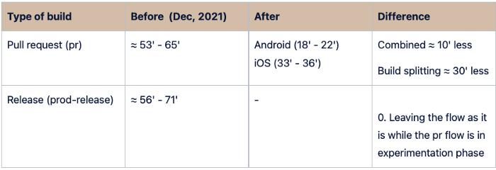
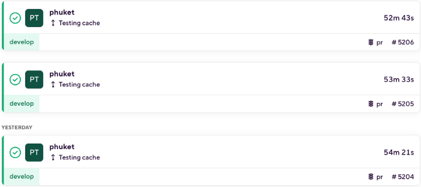
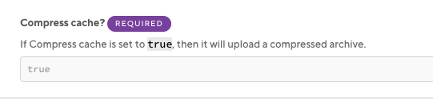
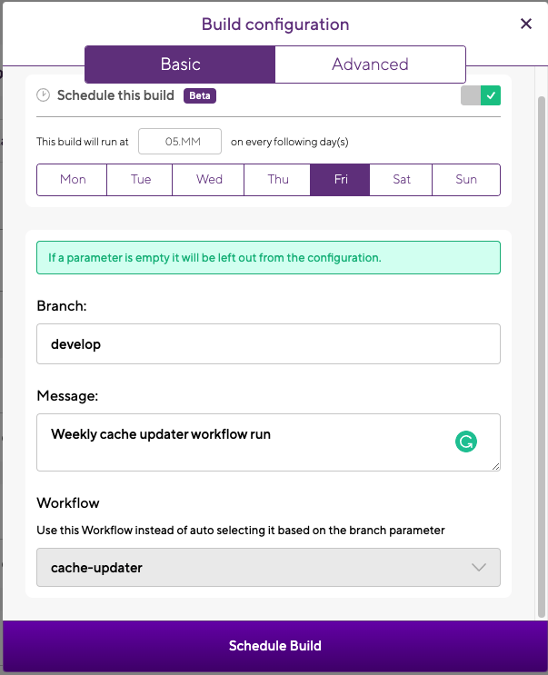
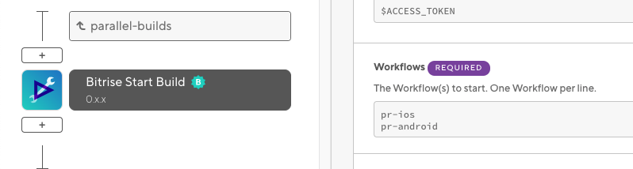

The application I currently work on takes a lot of time to build in Bitrise. Sometimes you have to wait almost 90 min for it to respond. If you are lucky it will build in about 1 hour. It's still a lot, I know.

We needed to do this optimization because of the concurrency-based Plan Deprecation update so we started preparing for it.

I managed to reduce the waiting time by a bit less than half, getting from builds taking about 1 hour to 25 min on average. Without any difficult steps, and without a deep knowledge about pipeline optimizations this was done in around 3 working days including investigation and testing.

Here I'll explain how.

_Initial times vs times after improvements_

Samples were taken only from the two most used flows. This is some internal documentation I did for my company. Basically, I reduced the time for the pull requests workflow, leaving the workflow for the production release as it is to see how it behaves in the upcoming time. After we find it is stable we'll switch that one too.

### Improvements done:

- Enabling caching
- Using compressed caching
- Cache updater workflow
- Splitting Android and iOS workflows.

### Enabling caching

Enabling caching for Node modules, Gradle, and Cocoa pods. Although it doesn't seem to improve that much from the previous 53 min, it does a more stable timing since we are not relying on the other servers to download the packages. We have noticed that some days those servers have downtimes and it increases the build times significantly sometimes by more than 30 min. Having them cached ensures a more linear time.
To enable caching in the workflows, it is as simple as adding Cache Pull & Cache Push steps in your workflow. More documentation about it here.

### Compressing cache:

Compressing cache when pushing it to the bucket in order to make the pulling of the cache faster. It made a difference of about 4 min faster than without compression.

To do this is as simple as setting the flag as true in the Cache Push step:

### Cache updater workflow:

Creating a scheduled flow that will run weekly, this flow will update the cache on a weekly basis to avoid having this process in our "pr" workflow, making it faster since the pr flow will just pull cache, not pushing it which takes about 7 min to 8 min in our case.

In other words:

- "pr" workflow always pulls cache.
- This is updated with a scheduled workflow weekly.

How to do this?

You can simply create a flow that builds together Android and iOS and add the Cache Push step at the very end of this flow.

And then you can schedule your workflow to run every certain amount of time, in my case I decided to do it weekly.

### Parallel builds, triggering iOS and Android builds in parallel.

Before the process was unified where the builds for Android and iOS were running in the same workflow one after the other. That forces you to wait until one build finishes before you can proceed with the next one.

Having them in two separate workflows has advantages and disadvantages.

#### Disadvantages

There are some things that run twice as the basic yarn commands. (Linter, ts tests, generating secrets for the bundle & translations). I was trying to re-use this in a general step and then run the single iOS and Android processes but is it not something that I found possible with the current Bitrise capabilities.

#### Advantages

- The time was reduced by half.
- Testers won't have to wait until both builds are complete to start testing.
- Faster delivery.
- Gives you a nice feeling of it being pretty fast. (or at least way more than before)

To be able to run parallel workflows you just need to use the step "Start Build"

The way how I did it was by creating a separate workflow that only contains this step and then in this step I'm calling both iOS and Android flows.

And that's all. That reduced the times by half.

### Future improvements I might want to look into:

- If the capability for parallel steps is improved, ideally the re-use of steps for the independent builds would be great. That would save from 6 min to 7 min in the whole process making it even faster.
- Look at the specifics for the Android build and the iOS archive process. For example, which optimizations we could do for the archive to be faster? Disable/enabled bitcode?
- More stuff to put in the cache. Only 3 main things were put in the cache but there are more things that could be put in there.

## Conclusions

As you can see, these improvements were not difficult and do not require a deep knowledge about pipeline optimizations.
It is important to improve these processes we use every day once in a while, sometimes we don't care about the time it takes because we don't mind waiting but on a bigger scale this makes a huge difference.

---

[Bitrise also posted it in their social media :)](https://www.facebook.com/bitrise.io/posts/pfbid02J9b2bn7j4odsGxGdG8u78Pf7HThFpPTGJrfTZhYhpJfipMLu1tnSf2KZSjjPMeLhl)
