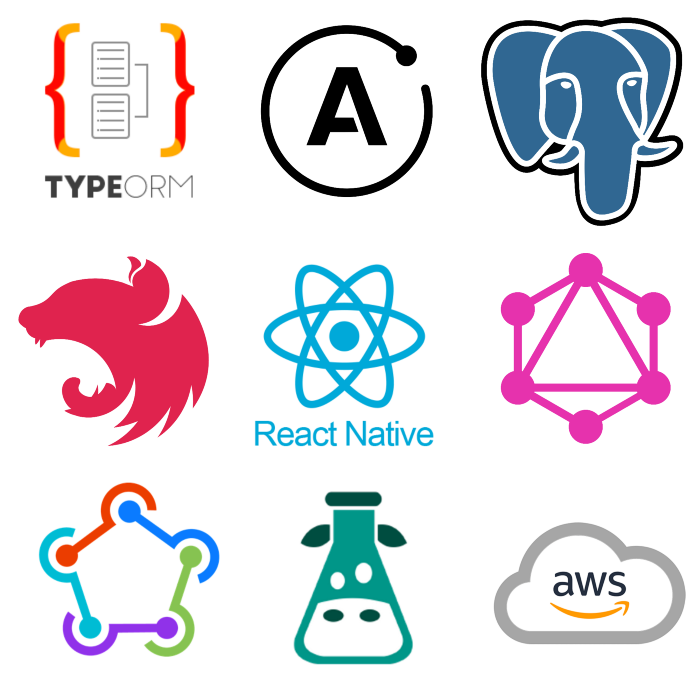

Recently I did some research and started working on a prototype for a personal idea I wanted to develop. I chose some tools accordingly for my needs and I would like to share my experience and what I like about this combo for a TypeScript developer.

## Background

I wanted to build a cross-platform application, which includes a mobile application for iOS & Android, as well as a web application to reflect some of the core functionalities of the mobile app but in web.

Besides this, I also wanted to have an API which I could use for all my apps. And later on if the project starts getting some traction, I wanted this to be scalable.

## Choosing the technologies: Starting with front-end

### React Native

In this case, I am the developer. And as someone that is more focus on front-end, specially for mobile applications and working with React Native already for a couple of years, I know the advantages of this technology when it comes about creating something for iOS & Android in a faster and good way

Based on that, I choose React Native as my front-end framework.

### React Native Web

Because I had seen react-native-web around for a while but had never used it before, I also decided to integrate it in my React Native project after doing some research. I saw a lot of reviews and specifically for the things I wanted to build (which was nothing too crazy) and it was a really good option.

When it comes about sharing code between web and mobile, I can say that about the 80% of my code is shared. The other 20% is adjusting the screens to be more web friendly, the navigation which is not that difficult to adjust and some small functionalities that I couldn’t make work that easily using React Native Web, e.g: Maps & Photo Uploader.

### React Navigation

It is a very known library for mobile navigation for React Native, and also supports some things for React Native Web. For my application it worked really nice, again I remark that my application is fairly small and it is nothing too crazy. Maybe if it was too big, not sure how scalable would be sharing the routing across mobile and web.

### Styled Components

Because the styles are written in a CSS way, it makes the styling easily shareable between mobile and web. And also the tool supports theming and other cool stuff which makes the development experience quite friendly.

For my case I am building right away dark and light mode so it was a must for me to have a theming since the beginning.

### React Native Paper

Because I wanted to build a quick prototype, it didn’t matter that much if the styles weren’t that custom. React Native Paper provides a bunch of components that look nice, support accessibility and they are also responsive.

Funny enough, the theming is very similar to the React Navigation one so I designed a theming that could be easily shared between the app, navigation and paper.

Most of the components are also supported for React Native Web, which makes the development way faster because everything is already shared cross-platform.

### Apollo Client | GraphQL

To connect the API with my front-end application I opted to use Apollo Client, it is also a very known tool and I also decided to work with this one because the back-end is also GraphQL.

Apollo Client helps the front-end to connect with GraphQL endpoints but also offers cache and other nice functionalities that I personally like. (global state management for example) You can read more about it here.

Next to this, I integrated a GraphQL code generator, which helps me autogenerating all the types based on the back-end schema. Together with GQLg, I also autogenerate mutations, queries and subscriptions based on the schema. Meaning that I don’t write anything in the front-end or the connection with the API since everything is autogenerated. This is my opinion accelerates my development a lot since I don’t have to worry about writing queries or mutations manually and I just consume the autogenerated resources.

### i18n for internalisation

For the first version of the project I wanted it to have Spanish and English are those are the languages I can easily translate (and have a decent translation) and put them into the app.

i18n is a very nice framework for this.

https://www.i18next.com/

## Back-end Technologies

As I haven’t done back-end for a while, I wanted to use something that is still more or less familiar for the things I do everyday, just because of simplicity and agility.

I got some inspiration from a friend that uses a similar stack and from a [Ben’s Awad full-stack tutorial](https://www.youtube.com/watch?v=I6ypD7qv3Z8).

### NestJS

I just discovered it this year and why did I choose it? Because it has a big community, it is as a docs says “extensive, versatile & progressive”, but also it has support for all the technologies I will list down below.

https://nestjs.com/

### TypeORM

Provides an excellent support to connect applications with any kind of database and it is very nice to use it when you like TypeScript.

https://typeorm.io/

### Apollo Server | GraphQL

As I wanted to use GraphQL for both back-end and front-end, I had to use Apollo Server in order to provide the endpoints. It connects really well if you also use Apollo Client in the front-end, and as I’m working in both sides I am really familiar on how this works.

You can read about it here. It provides self-documentation and also you can have a playground which is really useful to test the API.

### PostgreSQL

As PostgreSQL supports both SQL (relational) and JSON (non-relational) querying. I wanted to have this flexibility. Initially my models are relational but I might be experimenting with non-relational as well.

Also, it is a well known database and with NestJS works nicely.

## Others

- Fastlane: CI/CD for mobile applications.
- Google Analytics: Statistics and analytical.
- Sentry: Error tracking and monitoring.
- Cloudinary: Cloud-based image and video management services.
- AWS: I will be using the free tier initially to deploy my back-end and database.

## Summary

Front-end:

React Native, React Native Web, React Navigation, Styled Components, React Native Paper, Apollo Client, GraphQL & i18n.

Back-end:

NestJS, TypeORM, Apollo Server, GraphQL & PostgreSQL.

Others:

Fastlane, Google Analytics & Sentry.

## Learnings

My experience using this combination has been very nice. In case the project has success and it gains users, it will be very easy to scale since it uses good technologies and the architecture for the project is well organised. I will be writing about the architecture used for this project in another article.

I’m currently working full-time as a Mobile Developer with React Native but I also have some full-stack experience with Php & Node.js. It’s been easy to learn NestJS, as it is a Node.js framework and somehow it reminds me of Angular. As a non full-time back-end, I don’t have a broad knowledge about how to build a very scalable back-end but I feel that NestJS provides already a very organised architecture that makes the job easier as I don’t have to think much about folder/files structure. Because it also supports a lot of things out of the box, it makes it super easy to create a quick prototype and you don’t have to worry about so many things.

Because of the technologies, in case the project goes good I can also plan on getting investment moving forward, and because everything is scalable, it is also attractive technology wise for investors. And not only that, in case you want to have more people working with you when the project grows, it will be very easy to have more people working on it.

## What’s next?

The first plan is to release the API to a container which I can access remotely and then I will be able to connect my application to the cloud.

After that, finish the first version of the app. I will be focused first on delivering to the store the iOS app because of the map functionality, it’s been easier than the Android one since I don’t have to do much configuration using Apple Maps.

Later on I will finish Android, finish the map which is going to be different to the iOS one (will use Google Maps) and also I will make sure some other functionalities there work smooth and the performance is good.

And then last but not least, I will fix the remaining styling differences, maps and photo upload functionality for the web. And then I will plan the first release of the web as well.

At that point of time I will have everything fully released, I will be doing some self-promotion on Facebook groups and other platforms. I will be probably focused on adding more analytics and more error tracking, in order to deliver a good experience and learn from the user’s behaviour.

...

Notice that I did not mention what the app is about here as it didn’t really matter for the purpose of this article, I just wanted to show the cool tools that are around in 2022 if you want to build your own prototype as a solo developer.

However, in a couple of months I would like to share my full experience about going live using these technologies, and I will be sharing what went well and what did not go that well after releasing the first version. And of course, I will share the published app.

Thanks for reading, let me know in the comments if you have another nice stack you have experimented with lately.
