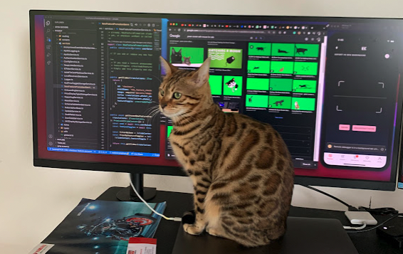
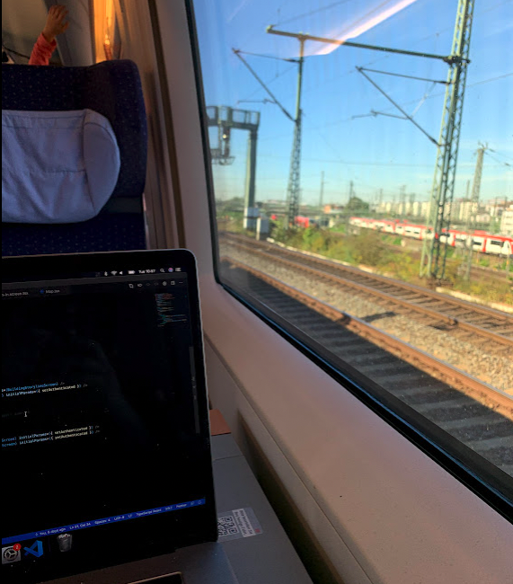

In the last couple of years I have been able to travel to multiple countries thanks to programming and also thanks to some companies that have allowed me to work fully remote.

However, not always that I code I do it for companies, I do also enjoy doing some personal projects as well as open sourcing and contributing. That's why I have some fun while doing it, because of my side projects. Without them, there is no really much motivation to just work on your daily things.

## Offline Work

Working offline can be benefitial if you are in places with really poor connection or also in case you are in a flight, a train without internet or in a ship in the middle of the ocean and you don't want to pay for internet there.

There are some projects that allow you to work fully offline. I'm not talking about projects company wise but about code projects.

If you have a project which you can fully install locally A.K.A a full-stack, db, server and front-end then you have gold there. Why? You would think this is not really nice, but whilst you are [killing time](#killing-time) somehow you gain some [extra focus](#extra-focus) (perhaps that's only my case, but there is a change that it is for you too).

Being able to work offline has the advantage of being very productive whilst that's the only thing you can do. In my case because I mostly travel solo that works pretty well. Now, if you are with friends, couple or family, please try to enjoy with them too and don't go to travel just to code. Do it when they are resting or something, respect your company.

_Disadvantages_; not always is that nice if you are stuck with a bug and you need to search something. In that case being offline sucks because the first thing you want to do is checking Stack Overflow but because you are offline, it's most likely that you will get stuck. In that case, try to switch to something else if you can, or if you can't switch to something else, just go to another project either from your company or personal, open source, e.t.c...

## Killing Time

Sometimes you are in places where you have everything you need to code and unfortunately you have to be there just waiting. A.K.A airports (most of the times).

If you are reading this you're quite lucky, coding at an airport is fun because you are still in mainland and you can get internet either from there or from your own, you can also charge your laptop, phones and whatever you need but most importantly, you can get some coffee and food, that's right, please grab something to eat before coding and get fully focused :)

Sometimes it is unfortunate and your flight can get delays. Lucky you, you had something to do so who cares, as long as the delay doesn't affect your final plans everything should be good, you just gained some productivity hours there.

## Extra Focus

A clear example of extra focus is this, I wrote this in about an hour whilst travelling from Rhodes to Rotterdam in a 4h flight. Normally I can't write that fast and accurately because there are too many distractions.

I have found myself getting a lot of focus whilst I am killing time or offline, I can tell I am around %400 more productive compared to when I work from my home, and around %2000 compared to when I work on-site (I know right, working on-site sucks, I just go to say hi and hang out with colleagues a bit).

Maybe it is because you don't have distractions or maybe it is because you don't have anything else to do that you gain focus. Internet itself can distract you, you want to check social media, you want to check a song you remembered or you want to check how to be productive while travelling and coding, you see, so many distractions. I think one of the main focus reasons is not having internet.

Next to the not internet thing, when you are working online with your co-workers of course it can be very useful if you have to align tasks, coordinate things, help and unblock people but also becomes super distracting. Every time you get a message you lost some small focus, whilst if you are working offline you don't have that problem.

Photo of my biggest distraction when working from home:

## Bad Internet Connection

Sometimes or maybe most of the times you need internet to accomplish your tasks, have a call with your co-workers or just copy and paste from Stack Overflow. But it turns out that the hotel you booked has an internet connection shared for 300 guests lol. That's why if you want to get a bit of a better connection, just check the ratings of the hotel before hand regarding to that topic, or even better just get your own hostpot.

In case the above is not possible, you can also go to co-working spaces. Not something I've done so much myself because I don't like to get that feeling of working on-site while working remotely but it is a good option.

## Poor Calls

Sometimes because of the [bad internet connection](#bad-internet-connection), your calls will suck. You are in the middle of a standup and then it's your turn to give your update and you see all the faces frozen in the screen or they just say, "yo Mateo, we can't hear you (you poor, get a better hotel, we don't pay you enough or what)".

For this, you just have to be prepared before hand, if your team doesn't care that much about it then fine, but because normally they do and maybe you have multiple calls within the day, just try to get a better connection using the options mentioned in the [bad internet connection](#bad-internet-connection) section.

It is not nice to have poor calls, it can also be a bit unrespectful depending on which kind of call you have, so get that fixed.

## Bad Desks

Oh yeah the most important one. Before you book a hotel, if you are going to be working from there for a couple of days please check that at least if has a desk and a normal chair. Once in Istanbul I was working in half a desk and sitting on the bed because there was no chair and I was there for 4 days. I managed but when I went back to the Netherlands I had a massive pain in my back which you should avoid at all costs if you are a developer.

## Conclusion

Working while travelling is awesome, you get to know a lot of places you wouldn't go to if you were only using your holidays but at the same time you can also have the advantage of the extra focus as I described, which is I think beautiful when you want to accomplish something short-term.

Because all experiences are different, I would love to see my fellow traveller programmers commenting about this. Maybe you don't get that extra focus and maybe you hate to do it. In any case, thanks for reading my experience.

Below a photo working in one of my trips:

