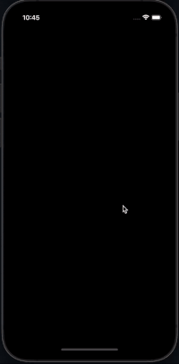
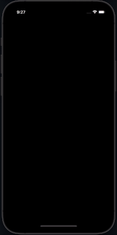
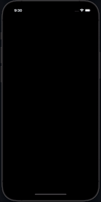

Animated balloons are a pretty attractive way of engaging with users. They can be used to attract user’s attention by congratulating them inside your app or by simply celebrating something, for instance. In this article, we will explore how to create animated balloons with React Native.

In the following sections, we will see how to use [react-native-fiesta](https://github.com/mateoguzmana/react-native-fiesta) to add some animated balloons into your application with some few lines of code.

`react-native-fiesta` is a library that provides a set of celebration animations built with [@shopify/react-native-skia](https://github.com/Shopify/react-native-skia). The nice thing about this is that Skia offers high-performance 2d graphics for React Native.

## Installing Dependencies

The first step is installing `react-native-fiesta` package which provides us with all the necessary animations for our project. To do that, we need to install it by running the following command:

```bash
yarn add react-native-fiesta
```

`react-native-fiesta` fully depends on `@shopify/react-native-skia` so you have to package that one as well.c You can do it with the following command:

```bash
yarn add @shopify/react-native-skia && npx pod-install
```

After installation has been completed, we can use the library to add the animated balloons to our app.

## Adding Animation Using Fiesta

To do that, we need to import the library in one of our components, we will use the App component as a base:

```typescript
import React, from 'react'
import { Balloons } from 'react-native-fiesta'
```

After importing the Balloons from Fiesta, we can proceed to use them:

```typescript
function App() {
  return <Balloons />;
}
```

And that’s it, You have some animated balloons in your application. You can use them to celebrate a user’s birthday, a first purchase, a new goal achieved inside the app, or any other thing you might want to celebrate. The options are endless.



## Customising Fiesta Balloons

You can also customise the theming of the balloons. Let’s say you want to have a Colombian theme. You can do that by doing the following:

```typescript
<Balloons theme={["#FCD116", "#003893", "#CE1126"]} />
```

That’s it!



Fiesta also provides some other themes. You can use them just by importing them:

```typescript
import { Balloons, FiestaThemes } from 'react-native-fiesta'

…

<Balloons theme={FiestaThemes.Neon} />
```

And then you will have some animated balloons with some neon colours.



## Conclusion

In this post, we have taken a look at how add some animated balloons in React Native using `react-native-fiesta`. Now you can celebrate with your users and engage with them as never before.

You might be familiar on how Twitter celebrates a birthday in their platform. These balloons are inspired by that.

## Links

- [react-native-fiesta](https://github.com/mateoguzmana/react-native-fiesta)
- [@shopify/react-native-skia](https://github.com/Shopify/react-native-skia)
